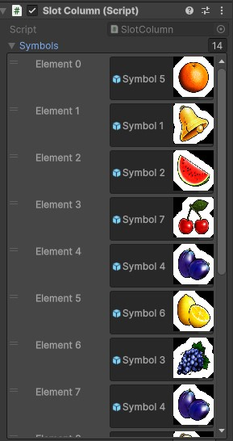
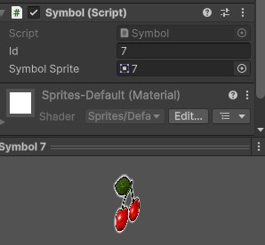

# Creacion de columna

Para crear una columna nueva se puede agregar en el listado "Symbols", el cual recibe prefabs.

Los prefabs se necesitan crear previamente

Deben ser sprites para llevar Symbol

El cual depende de un id y del sprite

# Creacion de Tabla de pagos